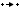

# ChemGrid 2022

## Install

- Clone repo and install requirements.txt

## Run

- Run `game_demo.py` for human play
- Run `gym_env_demo.py` for gym example

## Game description

In this game agents can build molecules by joining, breaking and exchanging other molecules. Agents need to complete
their survival molecule in order to stay in the game. The faster they build it the more time they can spend to build
other stuff.

Each agent starts off with an initial inventory and a survival molecule. Agents can use the molecules in their
inventories to construct new molecules until (and beyond) their target is reached.

There are four high-level actions

###  Join

Join two existing molecules by connecting them such that there is no overlap between the two and at least one pair of
molecules are adjacent.

###  Break

Break an existing molecule on a bond (edge) that is the only bond between the two subcomponents.

###  Create a contract

Create a "contract" by offering one of the items of the agent in exchange for any existing or non-existent molecule.

###  View contracts

View contracts that have been created so far.

## Gym env

```python
import gym
from tqdm import tqdm

from chemgrid_game.chemistry import generate_random_mol

if __name__ == '__main__':
    n_agents = 2
    n_atoms = 10
    max_size = 8
    n_colors = 3

    seeds = range(n_agents)
    targets = [generate_random_mol(s, n_atoms, n_colors, max_size=max_size) for s in seeds]
    inventories = [[generate_random_mol(i, n_atoms=2, n_colors=n_colors, max_size=max_size)] for i in range(n_agents)]

    env_id = 'ChemGrid-v1'
    kwargs = dict(
        n_agents=n_agents,
        continuous_actions=False,
        initial_inventories=inventories,
        survival_mols=targets
    )
    env = gym.make(env_id, **kwargs)

    obs = env.reset()
    for i in tqdm(range(1000)):
        action = env.action_space.sample()
        new_obs, rewards, dones, infos = env.step(action)
    
    env.close()
```